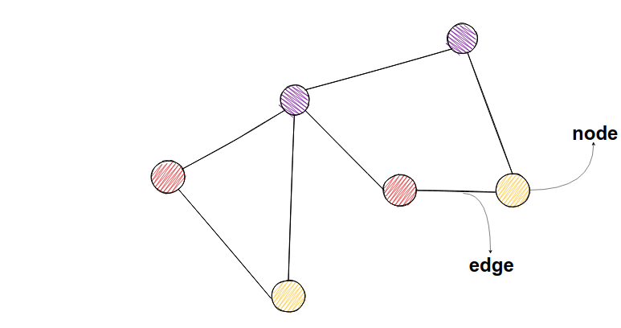
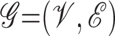
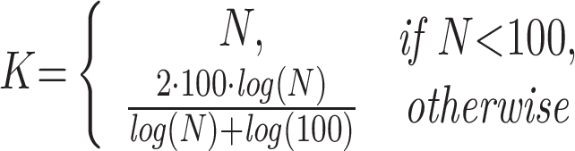

# monocle 2

## 《**Reversed graph embedding resolves complex single-cell** trajectories》

#### 《Nature Methods》第14卷第10期 2017年

## 介绍

​        大多数细胞状态转换，无论是在发育、重编程还是疾病过程中，都以基因表达变化的级联为特征。我们最近引入了一种称为“**伪时间排序**”的生物信息学技术，该技术将**机器学习**应用于单细胞转录组测序（RNA-Seq）数据，按进展顺序对细胞进行排序，并重建它们在分化或经历其他类型生物学转换时的“轨迹”。尽管人们努力开发可扩展、准确的伪时间重建算法（最近在2中进行了回顾），但现有工具有几个主要限制。大多数伪时间方法只能重建线性轨迹，而其他方法如Wishbone3 或 DPT4 支持分支识别，但它们要么无法在轨迹中识别多个分支点，要么要求用户指定分支和细胞命运的数量作为输入参数。

在这里，我们描述了Monocle 2（补充软件和https://github.com/cole-trapnelllab/monocle-release），它应用了**反向图嵌入（RGE）**，这是一种最近开发的机器学习策略，以准确重建复杂的单细胞轨迹。Monocle 2不需要关于特征化生物过程的基因、轨迹中的细胞命运或分支点数量的先验信息，也不需要实验设计的输入。Monocle 2不仅优于其前一个版本，而且也优于最近开发的方法，产生了更准确、更稳健的轨迹。

---

## 图（Graph）

> 反向图嵌入（RGB）Reverse Graph Embedding 算法可以看作**图嵌入**的逆过程。  

### 为什么是 graph 而不是 figure？

1. **Figure**：
   - "Figure" 通常指的是在文档、报告或书籍中的插图、图表或图片。它是一个通用术语，用于表示任何类型的图形或图像。在学术文献中，"figure" 可能包括照片、图表、图形、示意图等。例如，在科学论文中，一个 "figure" 可能是实验结果的图表或者实验装置的示意图。
2. **Graph**：
   - "Graph" 通常用于表示图论中的数学结构，它由节点（vertex）和连接节点的边（edge）组成。在这个意义上，"graph" 可以指代各种类型的图，如有向图（directed graph）、无向图（undirected graph）、加权图（weighted graph）等。在计算机科学和数学领域，"graph" 是一个具体的数学概念。

#### 图嵌入的应用

> 细胞性质相似与用户相互认识之间具有趋向性

---

#### 工作中图嵌入的例子 cellchat

cellchat 最终将图 转化为低维向量

> cellchat 的表现形式很像图嵌入，严格来说并不是图嵌入。
>
> 图嵌入经典算法 Node2Vec和DeepWalk 有兴趣可以了解一下，当前推荐 可能认识的人 很多算法都来自图嵌入

#### 工作中比较有代表性的反向图嵌入：

>  云平台 网络图交互

## **Reversed graph embedding** 实现

Monocle 2 使用了一种称为反向图嵌入（Reversed Graph Embedding，RGE）的技术来学习描述单细胞实验的图结构。RGE 同时学习了代表细胞轨迹的主要图，以及一个将轨迹上的点（嵌入到低维空间中）映射回原始高维空间的函数。RGE 的目标是学习一组潜在点，这些点能够同时捕捉细胞的轨迹和其在高维空间中的原始特征。

这里的N是指集合的数量（或者细胞的数量），以及连接这些潜在点的无向图 Y。

> 低维空间中潜在的点 对应了高纬度空间中的输入数据 X！这里的每一个 x 都是一个向量，对应了高变基因，每个高变基因都是一个维度

图Y包含一组顶点 V 和一组加权的无向边 E ，其中每个 V 对应于潜在点 Z ，因此该图也存在于潜在的低维空间中。

在单细胞轨迹构建问题的背景下，X通常是单细胞RNA测序实验中第i个细胞的特征基因表达值的向量（例如，基于dpFeature选择），Y 是学习到的轨迹（例如，一棵树），沿着这条轨迹细胞转移，z是对应于细胞的轨迹上的主要点。

RGE学习了图Y以及一个将其映射回输入数据空间的函数。让Bji表示边(Vi,Vj)的权重，它代表了Zi和Zj之间的连通性。

换句话说，Bji > 0 表示边(Vi,Vj)在图Y中存在，否则为0。

> 意味着 并不是所有的细胞特征都会彼此相连

将fY定义为从Y到高维空间中某一点的投影函数。为了学习Y、Z和fY，我们需要优化以下目标函数：

其中，Gb是一组可行的图结构参数集合，参数化为{Bi,j，Ai,j}，F是一组将潜在的低维点映射到原始高维空间中的函数。

> 在数学中，一个求和符号左边有三个"min"的情况通常表示通过最小化三个不同的目标函数来解决一个多目标优化问题。这种情况下，我们试图找到一组参数，使得这三个目标函数都能达到最小值。这种方法称为多目标优化或多目标优化。
>
> 通过权重 降维后潜在点的欧氏距离平方与权重的乘积 求和 使得最小化三个不同目标函数

上述优化将学习潜在空间中的图结构，但它并没有衡量潜在点与观察到的数据之间的偏差。换句话说，没有努力确保图节点以与观察到的数据点云相关的方式嵌入。为了确保图描述了观察数据的整体结构，RGE旨在定位潜在点，使它们在函数下的映像（即它们在高维空间中的相应位置）接近于输入数据，同时也确保低维主要图上的相邻点在输入维度中是“相邻的”。优化问题被构建为：

> 通过映射关系可见 新公式 低维度 潜在点Z 通过f 函数映射回高纬度空间，在高纬度空间计算欧氏距离 并与 低纬度空间欧氏距离累加计算
>
> 其中λ是一个参数，用于调整这两个求和的相对强度（属于参数的范畴）。在实践中，实现反向图嵌入需要我们对Gb和f加以一些约束，如下面简要总结的部分所述。

---

### SimplePPT

> monocle2 采用的并不是SimplePPT 算法 而是 DDRtree 算法，文章中提到该算法是因为 DDRtree 是基于 SimplePPT 算法思想进行的开发！

SimplePPT（Simple Principal Tree）是一种用于学习数据点集的主要图（principal graph）的机器学习算法。它是反向图嵌入（Reversed Graph Embedding, RGE）技术的一种实现。SimplePPT的目标是在不依赖于数据点在原始空间中的确切位置的情况下，学习一个树形结构，这个树形结构能够捕捉数据点之间的相似性和差异性。

在SimplePPT中，主要图是一个无向图，其中包含一组顶点（代表数据点）和边（代表数据点之间的关系）。这个图通常是通过以下步骤构建的：

1. **降维**：首先，高维数据通过降维技术（如主成分分析PCA）映射到一个低维空间。
2. **聚类**：在低维空间中，算法识别出一组聚类中心，这些中心代表了数据点的集合。
3. **构建树**：算法通过连接聚类中心来构建一个**最小生成树**，这个树的结构反映了数据点之间的相似性。
4. **优化**：通过优化过程，算法调整聚类中心的位置，使得它们更好地拟合原始数据点，同时保持树的结构。

SimplePPT的关键特点是它简化了优化问题，将图的顶点和边的权重作为一个单一的变量进行优化。此外，它使用经验量化误差作为损失函数，这是衡量低维表示和其对应观测点之间差异的指标。通过这种方式，SimplePPT能够有效地学习数据的主要结构，而不需要对数据的全局结构有先验知识。

在Monocle 2中，SimplePPT是用于学习单细胞RNA测序数据的主要图的算法之一。它有助于识别细胞状态转换的轨迹，并揭示细胞分化过程中的关键事件和决策点。通过这种方式，SimplePPT为理解复杂的生物过程和细胞命运决策提供了强大的工具。

---

### **The principal** L1 graph algorithm

针对samplePPT 进行优化的反向图嵌入算法，原理类似

---

### DDRTree: Discriminative dimensionality reduction via learning a tree 

DDRTree是Monocle 2默认使用的RGE技术，它提供了两个SimplePPT学习框架所没有的关键特性。首先，DDRTree不假设图存在于输入空间中，并且可以在学习轨迹的同时降低其维度。其次，它也不要求图中每个数据点都有一个节点，这大大加速了算法并减少了内存占用。

与SimplePPT类似，DDRTree为每个细胞学习了一个潜在点，同时学习了一个线性投影函数f(z)=Wz，其中W=[w1,w2.....wd] ∈RD×d是一个矩阵，其列形成一个正交基W{W1,W2,...,Wd}（D是特征基因的维度，而d 是潜在空间的维度）。DDRTree同时学习了第二组潜在点Y上的图。

1. **构建主图（Principal Graph）**：Monocle 2算法首先通过无监督学习的方式构建一个主图。这个主图是一个低维的、有向的图结构，它能够捕捉到单细胞数据中的主要变化趋势和细胞状态的转换路径。
2. **图嵌入（Graph Embedding）**：在构建了主图之后，算法会对每个单细胞进行图嵌入，即将每个细胞映射到主图上的一个点。这个映射过程是基于细胞的高维特征数据来进行的，目的是在低维空间中找到最能代表该细胞状态的位置。
3. **移动点以匹配主图**：在所有细胞都被映射到主图上的相应位置后，算法会进一步调整这些点的位置，使得它们更紧密地对应于主图中的细胞状态转换路径。这个过程可能涉及到对点的位置进行微调，以确保它们不仅能够反映单个细胞的状态，还能够反映出细胞之间的转换关系。
4. **优化过程**：为了确保映射的准确性和稳健性，算法可能会采用一些优化技术，比如最小化重构误差或者最大化数据点在低维空间中的局部结构保持性。这样可以确保主图中的每个点都能够尽可能准确地代表原始高维空间中的细胞状态。

在Monocle 2中，提供了一个自动选择K值的过程，该过程应基于实验中细胞数量 N，对各种数据集都能很好地工作。

> K <= N

在第一次优化迭代中，这K个中心点是通过在低维空间中使用 k-medoids聚类来初始化的。

---

### Pseudotime calculation and branch assignment

在文章中提到的 **伪时间计算和分支分配** 部分讨论了如何使用Monocle 2进行伪时间（pseudotime）计算和分支分配。这是单细胞分析中的关键步骤，用于重建和理解细胞随时间或不同状态转换的动态过程。以下是该部分的主要内容概述：

1. **伪时间计算**：伪时间是一种度量，用于在无时间标签的单细胞数据中推断细胞状态转换的顺序。Monocle 2通过在主要图（如由DDRTree学习得到的）上计算每个细胞到根节点的最短路径长度（即最小生成树的边的数量）来分配伪时间。这个过程假设细胞在分化过程中沿着主要图的路径逐渐变化，伪时间反映了细胞在这条路径上的位置。
2. **分支分配**：Monocle 2通过深度优先搜索（DFS）遍历主要图，识别分支点，并将每个细胞分配到特定的分支或轨迹段上。分支点是细胞命运决策的点，细胞在这些点上可能分化成不同的细胞类型或状态。通过这种方式，Monocle 2能够揭示复杂的细胞分化路径和决策点。
3. **主要图的学习**：Monocle 2首先调用DDRTree算法来学习描述单细胞实验的主要树。这个树的顶点是细胞群的聚类中心，边表示聚类中心之间的连接。
4. **投影和最小生成树**：为了计算伪时间，Monocle 2将细胞的低维表示投影到主要图上，并在聚类中心形成的最小生成树上构建伪时间。这个过程涉及到找到每个细胞在树上最近的位置，并计算到根节点的最短路径。
5. **分支结构的编码**：Monocle 2通过递归地遍历主要树来编码每个细胞在分支结构中的位置，并为每个细胞分配一个轨迹段。这个过程还涉及到递增一个段计数器，每当遇到新的分支点时。
6. **准确性和稳健性的评估**：文章还讨论了如何评估伪时间分配和分支分配的准确性和稳健性。这通常涉及到将Monocle 2的结果与已知的生物学标记或实验验证的结果进行比较。

图 1. Monocle 2 发现肌母细胞分化中的隐蔽替代结果 (A) Monocle 2 通过反向图嵌入学习单细胞轨迹。每个细胞可以表示为高维空间中的一个点，其中每个维度对应于一个排序基因的表达水平。首先，高维数据通过多种降维方法（如PCA（默认）、扩散图等）投影到一个低维空间（Z）。然后，Monocle 2 在自动选择的数据质心集合上构建一个最小生成树。质心的数量（黑色菱形）是根据细胞数量的亚线性比例确定的。这些质心是通过在初始化的低维空间中使用k-medoids聚类自动选择的。然后，算法将细胞移向它们在树上最近的顶点，更新顶点的位置以“适应”细胞，学习一个新的最小生成树，并迭代地继续这个过程，直到树和细胞的位置收敛（参见方法中的方程3）。在整个过程中，Monocle 2 保持高维空间和低维空间之间的可逆映射，从而既学习了轨迹又减少了数据的维度。实际上，该算法在点Z上充当软K均值聚类，将它们映射到质心，并共同学习质心上的图。一旦Monocle 2 学习了树，用户选择一个尖端作为“根”。每个细胞的伪时间被计算为其沿树到根的测地线距离，并且根据主图自动分配其分支。 (B) Monocle 1 重建了分化的人类骨骼肌母细胞（HSMM）的线性轨迹。 (C) Monocle 2 自动学习了潜在的轨迹，并检测到24-72小时的细胞分为两个分支。Monocle 1 和 Monocle 2 都使用了dpFeature（补充图1；方法）选择的相同基因进行排序。 (D) 在Paul 数据集上，每个算法在重复抽取80%的细胞样本下的伪时间计算或分支分配的准确性。使用基于标记的排序（见方法）作为每个软件结果的基准进行比较。 (E) 在Paul 数据集上，每个算法在重复抽取80%的细胞样本下的伪时间计算或分支分配的一致性。所有成对的下采样都用来计算皮尔逊相关系数（Pearson's Rho）和调整后的Rand指数（ARI）。Monocle 2、DPT和Wishbone都使用完整数据集进行基准测试，而Monocle 1只使用随机下采样的300个细胞进行基准测试。

